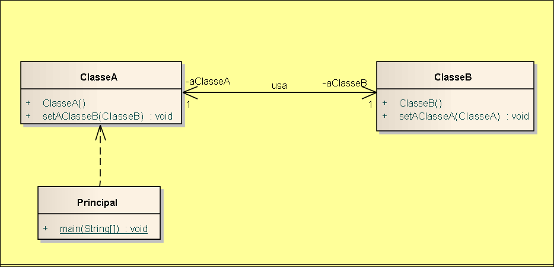

# Exemplo de implementação de relacionamento associação bidirecional e multiplicidade 1 para 1 em Java.

## Contextualização

- Programa em Java que demostra a implementação do relacionamento associação bidimensional "usa" com multiplicidade 1 para 1. 
- Uma associação é uma conexão entre classes e representam as relações entre os objetos. 
- Associações são representadas em um diagrama de classe através de uma linha conectando as classes associadas. 
- Os dados podem fluir em uma ou em ambas as direções através do link. 
- O projeto foi desenvolvido no NetBeans deve ser chamado relacionamento_uml_associacaobimulti11_java. 
- Utiliza o Apache Maven para a automatização da construção. 

## Diagrama de classe

## Arquivo do projeto

O arquivo Modelo.EAP é o projetodo sistema utilizando ferramanta CASE Enterprise Arquitect.

## Outros arquivos

- pom.xml - Arquivo de configuração da ferramenta de automação Maven.
- *.bat - Arquivos de lote(Batch) de console para tarefas compilar, executar, documentar, empacotar e limpar o projeto.